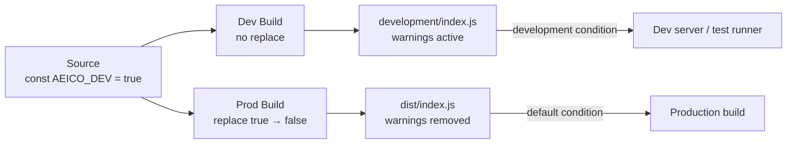

# Development Mode

aeico ships two builds per package:

| Build | Location | `AEICO_DEV` | Behaviour |
|---|---|---|---|
| **Development** | `development/index.js` | `true` | Dev warnings and invariant checks are active |
| **Production** | `dist/index.js` | `false` | All dev-only code is removed (zero runtime cost) |

Your toolchain selects the build automatically via the `"development"` [export condition](https://nodejs.org/api/packages.html#conditional-exports) in `package.json`.

---

## Build Tools

### Vite

Vite includes the `development` condition automatically in dev mode. No configuration needed.

```ts
// vite.config.ts — zero config for dev mode
export default defineConfig({
  // Vite dev server automatically resolves the "development" condition
})
```

`vite build` (production) omits the condition, so the production build is used.

### Webpack

```js
// webpack.config.js
module.exports = (env, argv) => ({
  resolve: {
    conditionNames: [
      ...(argv.mode === 'development' ? ['development'] : []),
      'import',
      'require',
    ],
  },
})
```

### Rollup (with @rollup/plugin-node-resolve)

```js
// rollup.config.js
import { nodeResolve } from '@rollup/plugin-node-resolve'

export default {
  plugins: [
    nodeResolve({
      exportConditions: ['development'], // remove for production
    }),
  ],
}
```

### esbuild

```js
// build.js
await esbuild.build({
  conditions: ['development'], // remove for production
})
```

### Parcel

Parcel respects `package.json` export conditions automatically. Use the `--conditions` flag:

```bash
parcel build --conditions development   # dev build
parcel build                            # production (no condition)
```

---

## Dev Servers

### @web/dev-server

```js
// web-dev-server.config.js
export default {
  nodeResolve: {
    exportConditions: ['development'],
  },
}
```

### Web Test Runner

```js
// web-test-runner.config.mjs
export default {
  nodeResolve: {
    exportConditions: ['development'],
  },
}
```

To run tests in both modes (Lit-style):

```js
// web-test-runner.config.mjs
const mode = process.env.MODE || 'dev'

export default {
  nodeResolve: {
    exportConditions: mode === 'dev' ? ['development'] : [],
  },
}
```

```bash
MODE=dev npm test    # run tests with dev warnings
MODE=prod npm test   # run tests against production build
```

### Vitest

```ts
// vitest.config.ts
export default defineConfig({
  resolve: {
    conditions: ['development'],
  },
})
```

---

## TypeScript

If your code references `AEICO_DEV` directly (e.g. in tests or custom dev-only utilities), declare the global:

```ts
// env.d.ts
declare const AEICO_DEV: boolean
```

---

## How It Works

1. **Source code** uses a plain constant: `const AEICO_DEV = true`
2. **Dev build** leaves it as-is → `if (AEICO_DEV) { /* warnings */ }` stays
3. **Prod build** replaces it via `@rollup/plugin-replace`: `const AEICO_DEV = true` → `const AEICO_DEV = false`
4. TypeScript eliminates dead code → dev-only branches vanish from production output


